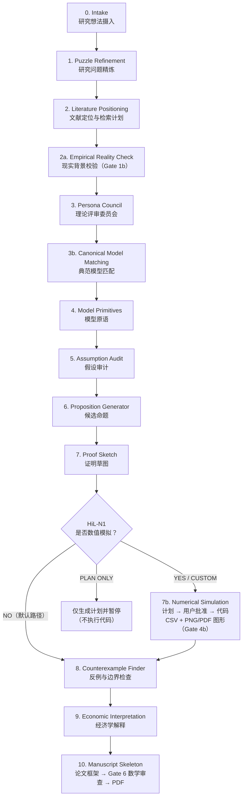

<a href="https://doi.org/10.5281/zenodo.20686025"></a>
# pAI-Econ-claude

<p align="center">
  
  
  
  
  
</p>

<p align="center">
  <b>一个连接经济学实证发现与理论建模的 Claude Code Skill</b><br>
  pAI-Econ-claude 并不试图替代理论经济学家的原创工作，而是帮助实证研究者把经验现象、机制直觉和实证发现转化为更清晰的理论问题、经典模型参照、可检验命题和可审计的研究框架。
</p>

<p align="center">
  <a href="./README_EN.md">English Version</a> ·
  <a href="#快速开始">快速开始</a> ·
  <a href="#使用场景">使用场景</a> ·
  <a href="#理论模型库">理论模型库</a> ·
  <a href="#工作流">工作流</a>
</p>

> pAI stands for principal Agentic Investigator (Abdelmoneum, Beneventano, & Poggio, 2026).
---

## 作者与更新

**作者：** 

Chen Zhu / 朱晨（China Agricultural University | 遗传社科研究） 

Xiaolu Wang / 王晓璐（China Agricultural University） 

Weilong Zhang / 章维龙（University of Cambridge）  

**最后更新：** 2026 年 7 月 9 日 

---

## 致谢与来源

本项目受 **pAI/MSc** 启发，并基于其 research pipeline 思想改造为理论经济学方向的 Claude Code Skill。

Original pAI/MSc:
- Mahmoud Abdelmoneum
- Pierfrancesco Beneventano
- Tomaso Poggio
- MIT + Perseus Labs

Reference:
- [pAI/MSc: ML Theory Research with Humans on the Loop](https://arxiv.org/abs/2604.20622)
- [PoggioAI_MSc GitHub Repository](https://github.com/PoggioAI/PoggioAI_MSc-claude)


**反馈与优化:  Gin，Luo Zijun**

**模型库贡献: [hayeszhou](https://github.com/hayeszhou)**（空间动态一般均衡与贸易-劳动力动态模型条目，PR #3）

---

## 项目简介

**pAI-Econ-claude** 是一个面向实证经济学家的 **human-in-the-loop Claude Code Skill**，旨在帮助研究者从经验现象、机制直觉和实证发现出发，补齐研究中的理论版图。

它并不试图替代理论经济学家的原创工作，也不声称能够自动发现新的理论前沿。相反，它的定位是作为理论与实证之间的桥梁：帮助实证研究者识别合适的经典模型家族，澄清核心经济机制，明确模型扩展相对于既有理论的新增部分，并将经验问题转化为更规范的理论表述。

很多实证研究并不缺少数据、识别策略或估计结果，真正薄弱的地方往往是理论机制不够清楚：为什么这个现象应该成立？它对应哪个经典模型？新增变量改变了什么？命题是否只是由假设直接推出？福利含义是否超过了估计结果本身？

pAI-Econ-claude 试图为这些问题提供一个结构化工作流。它通过典范模型匹配、理论谱系检查、模型原语生成、假设审计、候选命题、证明草图和反例检查，帮助研究者把一个 empirical puzzle 转化为可讨论、可审查、可进一步合作发展的理论框架。

换句话说，它不是 AI 理论经济学家，而是一个面向实证研究者的理论建模脚手架：

> 帮助你知道自己的经验发现可以放进哪个理论传统里、还缺少哪一块机制、应该向理论合作者提出什么样的问题。

---

## 它解决什么问题？

经济学研究里的理论分析部分常常不是卡在"不会写"，而是卡在更早的阶段：

- 研究问题是否真的清楚？
- 这个想法应该放在哪个经典模型传统里？
- 新机制相对于经典模型到底新增了什么？
- 假设是否过强，是否只是为了推出想要的结论？
- 命题是否非平凡，还是由假设直接推出？
- 证明草图有哪些缺口？
- 是否存在简单反例？
- 经济学解释是否超过了形式结果本身？

**pAI-Econ-claude 的定位是帮助研究者把理论建模过程显性化、文档化、可回溯化，并在关键节点保留人类判断。**  

---

## 目标用户与使用责任

### 目标用户

本 Skill 的设计目标用户是**具备经济学理论基础的初级研究者**，包括：

- 经济学、管理学等相关方向的研究生（硕士、博士）
- 以实证研究为主、希望补齐理论机制的助理教授或博士后
- 熟悉微观经济学基础（效用最大化、均衡概念、信息结构）的研究者

使用本 Skill 要求用户具备以下基本能力：

- 能够独立判断一个均衡概念（如 BNE、SPE、竞争均衡）是否适合当前研究设定
- 能够识别一个命题是否非平凡，或仅由假设直接推出
- 能够评估一个理论机制是否与实证识别策略存在有意义的对应关系

**本 Skill 不面向对经济学理论建模完全陌生的研究者。** 如果用户无法独立判断 AI 生成的模型结构和命题的质量，则无法对输出结果承担应有的学术责任。

### 使用责任

> **使用者对最终发表成果负完全责任。**

本 Skill 是一个辅助工具，其输出（包括模型原语、命题、证明草图、论文框架和参考文献）均须经过使用者独立审核，方可用于任何学术写作和发表目的。

具体而言：

- **Proof sketch 不是正式证明**：标注为 `GAP` 或 `FALSE_RISK` 的步骤须由研究者自行推导和验证，不得在未经核实的情况下写入论文
- **文献引用须独立核查**：虽然 Stage 2 和 PDF 生成前均设有联网验证节点，但研究者仍须对最终发表的引用列表的准确性负责
- **理论贡献须研究者判断**：AI 无法最终裁定一个命题是否具有足够的创新性以满足期刊要求，这一判断须由研究者和合作者在充分理解领域文献的基础上做出
- **模型选择须研究者评估**：Canonical Model Matching 的建议仅供参考，研究者须根据自身对相关文献传统的理解做出最终选择

本项目及其作者不对使用本 Skill 生成的任何内容在学术发表中的准确性、原创性或充分性承担责任。

---

## 快速开始

### 安装

```bash
git clone https://github.com/maxwell2732/pAI-Econ-claude.git
cd pAI-Econ-claude
```

在该目录下打开 Claude Code，slash command 即自动可用：

```text
/theoretical-economics-claude-skill "你的理论经济学研究想法"
```

---

## 使用场景

pAI-Econ-claude 支持不同成熟度的理论想法。你不必每次都跑完整 pipeline，可以根据任务选择合适入口。

### 1. Model Extension Mode：从经典模型出发做机制扩展

当你已经知道大致模型家族，希望加入一个新机制时，可以使用这个模式。

例如：

```text
/theoretical-economics-claude-skill "
mode: model_extension

Extend a search model by adding product healthfulness and costly attention to nutrition labels.
Can a front-of-package label increase the probability that consumers choose healthier food?
"
```

Skill 会帮助你回答：

- 这个想法继承了哪个经典 search model？
- 新增的 healthfulness 机制改变了什么？
- 消费者什么时候会主动查看营养标签？
- 降低信息成本是否一定提高健康食品购买概率？
- 是否存在反例或边界情形？
- 这个扩展是否有足够理论贡献？

---

### 2. Phenomenon-to-Model Mode：从经济现象匹配理论模型

当你有一个现象或机制直觉，但不确定该用什么理论模型时，可以使用这个模式。

例如：

```text
/theoretical-economics-claude-skill "
mode: phenomenon_to_model

I want to incorporate genetic endowment into a health capital framework.
Genetic endowment affects productivity through childhood environment, health investment,
and human capital formation. Which theoretical model is most suitable?
"
```

Skill 会比较多个候选模型家族，例如：

- Grossman health capital model
- Becker / Ben-Porath human capital investment model
- Cunha-Heckman skill formation framework
- Roy model of comparative advantage
- lifecycle investment model
- intergenerational human capital model

然后推荐一个 baseline model，并解释其他模型为什么适合或不适合。

---

### 3. Model Critique Mode：审查已有理论模型

如果你已经有模型原语、假设或命题，可以让 Skill 像理论经济学 referee 一样进行审查。

```text
/theoretical-economics-claude-skill "
mode: model_critique

Here is my model setup:
[粘贴模型原语、时序、效用函数、均衡定义和命题]

Please audit model coherence, assumptions, non-triviality, proof gaps, and possible counterexamples.
"
```

它会重点检查：

- 模型是否闭合？
- 时序是否清楚？
- 信息结构是否完整？
- 均衡概念是否合适？
- 假设是否只是为了推出想要的结论？
- 命题是否非平凡？
- 证明草图是否存在跳步？
- 是否存在 2-agent、2-period、binary-action 的简单反例？

---

### 4. Full Pipeline Mode：从研究想法跑完整理论工作流

当你只有一个早期想法，希望从 intuition 一直推进到论文框架时，可以使用完整流程。

```text
/theoretical-economics-claude-skill "
mode: full_pipeline

Investigate whether a principal facing a privately informed agent can achieve first-best efficiency
through a forcing contract when the agent's outside option is type-dependent.
"
```

完整输出包括：

- refined research puzzle
- literature positioning plan
- canonical model match
- model primitives
- assumption audit
- candidate propositions
- proof sketches
- counterexamples
- economic interpretation
- manuscript skeleton（含 LaTeX 源文件和学术格式 PDF，pdflatex 编译）

---

### 5. Manuscript Skeleton Only：只生成论文框架

当模型、命题和主要结论已经比较清楚，只需要整理成 working paper 结构时，可以使用这个模式。

```text
/theoretical-economics-claude-skill "
mode: manuscript_skeleton_only

Here are my model, propositions, and proof sketches:
[粘贴已有内容]

Please organize them into a theoretical economics working paper skeleton.
"
```

---

## 工作流

pAI-Econ-claude 使用一个分阶段、可回溯的人机协作流程。

**关于 Stage 2a — Empirical Reality Check（现实背景校验）：**

在文献定位完成后、进入理论建模之前，pipeline 会先执行一次最小必要的现实背景校验（Stage 2a），并通过 **Gate 1b（Reality Fit Gate）** 进行把关。

这一步的目的是：在模型结构确定之前，检查用户描述的市场结构、制度情境或群体差异，是否与拟采用的理论模型家族的事实性假设相匹配。具体包括：

- 市场集中度是否支持"单一主导企业 + 原子化 fringe"结构，还是实际上是寡头市场？
- 是否有重要的战略竞争者被忽视？
- 产品是否被错误地当成同质品？
- 约束条件是否被错误识别（如分销渠道约束被写成生产产能约束）？
- 城乡、地区或群体差异的声明是否有公开数据支持？

Gate 1b 的三种结果：
- **PASS**：事实性假设与现实证据匹配，直接进入 Stage 3。
- **CONDITIONAL PASS (REFRAME)**：部分假设无法验证，但模型仍可继续，前提是论文明确将研究情境描述为"风格化假想市场"，而非声称描述具体现实市场。
- **FAIL (REROUTE)**：核心假设与现实数据矛盾，须先回到 Stage 1 修正研究问题，或重新在 Stage 3b 选择更合适的典范模型家族。

**关于 Stage 7b — Numerical Simulation（数值模拟与计算示例，可选模块）：**

> Numerical simulation is optional and runs only after explicit user approval. When selected, the workflow produces reproducible code, machine-readable results, and figures in both PNG and PDF formats. Numerical evidence is used for verification, counterexample search, and illustration, not as a substitute for formal proof.
>
> 数值模拟是完全可选的，只有在用户明确批准后才会运行。一旦选择运行，工作流会产出可复现代码、机器可读结果，以及 PNG 和 PDF 双格式图形。数值证据用于公式核验、反例搜索和机制示例，**不能替代形式化证明**。

Stage 7（Proof Sketch）完成后，pipeline 一定会在 **HiL-N1** 停下来询问用户是否进行数值模拟。完整分支逻辑：

```text
Stage 7 — Proof Sketch (+ Gate 4)
  → 询问用户是否进行数值模拟（HiL-N1）
      NO        → 不创建任何数值产物，直接进入 Stage 8
      PLAN ONLY → 只生成 numerical_simulation_plan.md，不执行任何代码，暂停等待
      CUSTOM    → 先收集用户的模拟需求（命题、变量、基准参数、参数范围、
                  坐标轴、模拟类型、图形格式）→ 生成计划
      YES       → 生成计划
  → 用户批准计划（HiL-N2 —— 未选择 APPROVE PLAN 前禁止执行任何代码）
  → 生成代码 → 运行模拟 → 保存机器可读 CSV 结果
  → 生成 PNG 和 PDF 图形
  → Gate 4b — Numerical Integrity Gate（数值完整性门）
  → 人工审阅数值结果（HiL-N3）
  → Stage 8 — Counterexample Finder（带数值交接信息）
```

每个参数都必须分类（理论归一化 / 有实证依据 / 示例性 / 用户指定）；每个数值结果都必须带认识论标签（如 `NUMERICALLY VERIFIED FOR SPECIFIED PARAMETERS`、`COUNTEREXAMPLE FOUND`、`NOT A PROOF`）；图形只有在用户于 HiL-N3 明确选择 `USE FIGURES IN MANUSCRIPT` 后才能进入论文（授权后默认在正文加入 1–2 张示例图：核心机制/福利图 + 至多一张参数扫描/regime 图，其余图形保留在工作区或附录）。如果数值模拟发现核心命题的反例，原始未修改命题将被禁止进入 Stage 10，直到在 Stage 8 / HiL-6 得到解决。

**关于 Gate 6 — Mathematical Review（数学审查门，v1.3.0 新增）：**

`manuscript.tex` 写完之后、编译 PDF 之前，pipeline 会强制运行一次全文数学审查。这个门的动机来自实际观察到的失误模式：均衡方程、一阶条件被包进 `proposition` 环境，当成研究结果呈现。五项检查：

- **陈述分类** — 每个定理类环境（definition / assumption / lemma / proposition / corollary / remark）的标签必须与内容匹配；均衡条件、FOC、恒等式属于模型设定部分，绝不允许标成 Proposition
- **独立重推导** — 每条展示推导（FOC、闭式解、比较静态符号）都先从模型原语独立推一遍，再与稿件逐项对照，避免审查者顺着稿件的错误代数往下读
- **符号一致性** — 符号先定义后使用，一个符号不得指代两个对象
- **命题与证明匹配** — 证明的结论必须恰好是命题的断言，量词必须对得上（"对所有参数成立"的断言只在基准点验证过即判不合格）
- **定义域与边界** — 除零、对非正数取对数、缺失内点条件等

低级错误（误标、不改变任何结论方向的代数笔误）直接改正并回写到上游文件（`candidate_propositions.md`、`proof_sketches.md` 等），全部记录在 `gates/gate-06-math-review.md` 的错误表中；实质性错误（重推导得出相反符号、证明未证得所声称的命题）会暂停 pipeline，按标准 gate 失败协议交研究者决定。审查未通过前禁止编译 PDF。

上游同时增加了两道对应检查：Gate 3 新增陈述分类检查（Check E，在命题生成源头拦截误标），Gate 4 新增证明草图关键代数的独立重推导检查（Check 7）。



---

## 核心阶段

| 阶段 | 名称 | 主要产出 |
|---|---|---|
| 0 | Intake | `research_intake.md` |
| 1 | Puzzle Refinement | `research_puzzle.md` |
| 2 | Literature Positioning | `literature_positioning.md` |
| 2a | Empirical Reality Check | `empirical_reality_check.md` |
| 3 | Theory Persona Council | `persona_council.md` |
| 3b | Canonical Model Matching | `canonical_model_match.md` |
| 4 | Model Primitives | `model_primitives.md` |
| 5 | Assumption Audit | `assumption_audit.md` |
| 6 | Proposition Generator | `candidate_propositions.md` |
| 7 | Proof Sketch | `proof_sketches.md` |
| **7b** | **Numerical Simulation（可选，须用户明确选择）** | `numerical_simulation_report.md` + `numerical_code/` + `numerical_results/` + `numerical_figures/`（PNG + PDF） |
| 8 | Counterexample Finder | `counterexamples_and_edge_cases.md` |
| 9 | Economic Interpretation | `economic_interpretation.md` |
| 10 | Manuscript Skeleton | `manuscript_skeleton.md` + `manuscript_skeleton.tex` + `manuscript_skeleton.pdf` |

---

## 理论模型库

pAI-Econ-claude 内置一个 `model_library/`，用于在建模前先匹配经典理论模型家族。

这一步非常重要，因为理论经济学研究不应该从零开始"凭空造模型"，而应先回答：

> 当前研究想法最接近哪个经典模型？  
> 它继承了什么？改变了什么？新增机制在哪里？

### 通用理论模型库

| 模型家族 | 适用问题 |
|---|---|
| Consumer Choice | 消费者选择、效用最大化 |
| Indirect Utility / Expenditure Minimization | 消费者理论中的对偶问题 |
| Discrete Choice / Random Utility | 离散选择、异质偏好 |
| Search Models | 搜索成本、停止规则、信息获取 |
| Costly Information Acquisition | 注意力成本、认知成本、信息处理 |
| Rational Inattention | 有限注意力、信息容量约束 |
| Signaling | 信号传递、教育信号、质量信号 |
| Screening | 逆向选择下的机制设计 |
| Moral Hazard | 隐藏行动、激励合同 |
| Adverse Selection | 柠檬市场、质量不可观测 |
| Hotelling / Product Differentiation | 产品差异化、空间竞争 |
| Disclosure / Persuasion | 信息披露、贝叶斯劝说 |
| Mechanism Design | 显示原理、激励相容 |
| Matching Models | 双边匹配、分配市场 |
| Social Learning | 羊群行为、信息瀑布 |
| Dynamic Optimization | Bellman 方程、生命周期选择 |
| OLG / Life-Cycle Models | 代际模型、生命周期投资 |
| Principal-Agent | 委托代理、合同设计 |
| General Equilibrium | 竞争均衡、市场出清 |
| Political Economy | 投票、集体选择、制度设计 |

---

### 产业组织专题库

| 模型家族 | 适用问题 |
|---|---|
| Oligopoly Competition | Cournot 数量竞争、Bertrand 价格竞争、Stackelberg 先动优势 |
| Entry Deterrence | 限制性定价、产能承诺、进入阻止与进入容纳 |
| Two-Sided Markets / Platforms | 双边市场定价、网络效应、平台竞争 |
| Price Discrimination | 一二三度价格歧视、版本化、市场细分 |

---

### 国际贸易专题库

| 模型家族 | 适用问题 |
|---|---|
| Comparative Advantage / Ricardian | 比较优势、贸易专业化分工、技术差异驱动贸易 |
| Heckscher-Ohlin | 要素禀赋与贸易模式、Stolper-Samuelson、Rybczynski、要素价格均等化 |
| New Trade Theory / Krugman (1980) | 产业内贸易、规模经济、品种效应、本土市场效应 |
| Melitz (2003) — Firm Heterogeneity | 企业异质性、出口门槛、选择效应、贸易的生产率重配置收益 |

---

### 人力资本与劳动经济学专题库

针对人力资本、教育、劳动市场、自动化和 AI 影响，Skill 还内置了专题模型库（均为具备均衡概念和可证命题的结构理论模型）。

| 模型家族 | 适用问题 |
|---|---|
| Becker Human Capital | 一般与专用人力资本投资 |
| Ben-Porath Model | 生命周期人力资本积累 |
| Roy Model | 部门选择、职业选择、比较优势 |
| Cunha-Heckman Skill Formation | 技能形成、早期投资、动态互补 |
| Technology of Skill Formation | 技能生产函数（CES） |
| Self-Productivity & Dynamic Complementarity | 技能形成的自我生产性与动态互补性 |
| Early Childhood Investment | 早期儿童发展投资与最优政策 |
| Intergenerational Transmission | 人力资本代际传递 |
| Education under Credit Constraints | 信贷约束下的教育选择 |
| Occupational Choice & Comparative Advantage | 职业选择与比较优势 |
| Acemoglu-Restrepo Task-Based Framework | 任务型生产、自动化与新任务 |
| Automation Displacement / Reinstatement | 替代效应、恢复效应、新任务创造 |
| Human Capital Adaptation to AI | AI 冲击下的人力资本调整 |
| Directed Technical Change / SBTC | 定向技术进步与技能偏向技术变迁 |

---

## 质量控制 Gates

Skill 内置多个质量门，用来避免"看起来像理论，其实没有理论贡献"的问题。

| Gate | 名称 | 检查内容 | 失败后建议 |
|---|---|---|---|
| Gate 1 | Novelty Risk | 问题是否可能已被文献回答 | 回到研究问题精炼 |
| Gate 2b | Canonical Fit | 模型家族是否匹配，是否只是经典模型换名 | 回到典范模型匹配 |
| Gate 2c | Theory Lineage | 是否明确理论祖先、继承内容和新增机制 | 回到典范模型匹配 |
| Gate 2 | Model Coherence | 模型原语、时序、信息结构是否一致 | 回到模型原语 |
| Gate 3 | Non-triviality | 命题是否非平凡，是否只是从假设直接推出 | 回到假设或命题 |
| Gate 4 | Proof Integrity | 证明草图是否诚实标注缺口；关键代数（FOC、闭式解、比较静态符号）是否通过独立重推导验算 | 回到命题或证明 |
| Gate 4b | Numerical Integrity（可选；仅当 Stage 7b 运行后） | 公式—代码一致性、可复现性、参数透明度、数值稳健性、结果完整性、认识论标签 | 回到 Stage 7b（修代码/参数）或 Stage 6（修改命题） |
| Gate 5 | Economic Meaning | 经济解释是否超过形式结果 | 回到经济学解释 |
| Gate 6 | Mathematical Review（manuscript.tex 写完后、编译 PDF 前） | 陈述分类是否正确（均衡条件、FOC 不得标成 Proposition）、逐条独立重推导、符号一致性、证明与命题是否匹配、定义域与边界情形 | 低级错误直接改正并回写到上游文件；实质性错误回到命题（Stage 6）或证明（Stage 7） |

Gate 失败不会被自动隐藏，也不会被包装成通过。Skill 会明确输出：

- failure reason
- severity
- recommended loopback stage
- whether a human override is possible

---

## 人类在环检查点

理论经济学中的关键判断不应由 agent 自动决定。因此 Skill 设置了多个必须由研究者确认的节点。

| 检查点 | 位置 | 研究者需要决定 |
|---|---|---|
| HiL-1 | Puzzle Refinement 后 | 是否接受研究问题 |
| HiL-2 | Literature Positioning 后 | 是否接受文献定位 |
| HiL-3 | Persona Council 后 | 是否接受理论评审结论 |
| HiL-4 | Model Primitives 后 | 确认均衡概念；这是硬停点 |
| HiL-5 | Proposition Generator 后 | 选择哪些命题进入后续分析 |
| HiL-N1 | Proof Sketch 后 | 是否进行数值模拟（YES / NO / PLAN ONLY / CUSTOM）——Stage 7b 绝不默认运行 |
| HiL-N2 | 数值模拟计划生成后 | 批准模拟计划与参数设计——未批准前禁止执行任何代码 |
| HiL-N3 | 模拟执行 + Gate 4b 后 | 接受/修改数值结果；决定图形是否允许进入论文 |
| HiL-6 | Counterexample Finder 后 | 如何处理反例与边界情形 |

其中 **HiL-4 是 hard stop**。均衡概念，例如 Nash、SPE、BNE、PBE、competitive equilibrium 等，必须由研究者确认后才能进入下一阶段。

---

## 五个理论评审 Persona

在 Persona Council 阶段，Skill 会模拟五类理论经济学评审者进行两轮讨论。

| Persona | 关注点 |
|---|---|
| Mechanism Theorist | 机制是否清楚、有趣、非平凡 |
| Mathematical Referee | 模型是否可形式化，证明是否可能成立 |
| Economic Intuition Referee | 结果是否有真正经济学含义 |
| Journal Positioning Referee | 更像投向哪个理论或应用理论期刊 |
| Brutal Skeptic | 最强反对意见是什么 |

Brutal Skeptic 的作用不是支持项目，而是专门攻击它。如果一个想法能经受住这个 persona 的质疑，才更值得继续推进。

---

## 输出结构

每次运行的产出统一存放在 `Exploration/` 目录下，按项目编号和模型简写命名。

自 2026 年 7 月 9 日起，`Exploration/` 整体列入 `.gitignore`：新项目工作区和生成的稿件默认只保留在本地，不会随仓库提交。如需公开某个项目，手动执行：

```bash
git add -f Exploration/Project_NNN_<Name>/
```


```text
Exploration/
└── Project_NNN_<ModelAbbrev>/        ← 例：Project_001_HumanCapitalAutomation
    ├── state.json
    ├── initial_context/
    │   └── hypothesis.md
    ├── outputs/
    │   ├── research_intake.md
    │   ├── research_puzzle.md
    │   ├── literature_positioning.md
    │   ├── persona_council.md
    │   ├── canonical_model_match.md
    │   ├── model_primitives.md
    │   ├── assumption_audit.md
    │   ├── candidate_propositions.md
    │   ├── proof_sketches.md
    │   ├── numerical_simulation_decision.md   ← Stage 7b（可选）：HiL-N1 决策记录
    │   ├── numerical_simulation_plan.md       ← Stage 7b（可选）：PLAN ONLY / CUSTOM / YES
    │   ├── parameter_definitions.md           ← Stage 7b（可选）：参数分类表
    │   ├── numerical_simulation_report.md     ← Stage 7b（可选）：批准执行后生成
    │   ├── numerical_code/                    ← Stage 7b（可选）：可复现 Python 脚本
    │   ├── numerical_results/                 ← Stage 7b（可选）：机器可读 CSV 结果
    │   ├── numerical_figures/                 ← Stage 7b（可选）：图形，PNG + PDF 双格式
    │   ├── counterexamples_and_edge_cases.md
    │   ├── economic_interpretation.md
    │   ├── manuscript_skeleton.md
    │   ├── manuscript_skeleton.tex   ← LaTeX 源文件（pdflatex + Computer Modern）
    │   └── manuscript_skeleton.pdf   ← 学术排版 PDF（pdflatex + Computer Modern）
    ├── gates/
    │   ├── gate-01-novelty-risk.md
    │   ├── gate-02b-canonical-fit.md
    │   ├── gate-02c-theory-lineage.md
    │   ├── gate-02-model-coherence.md
    │   ├── gate-03-non-triviality.md
    │   ├── gate-04-proof-integrity.md
    │   ├── gate-04b-numerical-integrity.md    ← Stage 7b（可选）：仅当模拟运行后
    │   ├── gate-05-economic-meaning.md
    │   └── gate-06-math-review.md             ← manuscript.tex 写完后、编译前
    └── logs/
        └── stage-log.md
```

---

## 设计原则

### 1. 人类在环，而不是全自动研究

理论经济学研究中的核心判断，例如研究问题是否有意义、均衡概念是否合适、命题是否值得推进、反例是否致命，必须由研究者决定。

AI 可以辅助生成、审查和反驳，但不应替代研究者做不可逆判断。

---

### 2. 先匹配经典模型，再构造新模型

Skill 在正式定义模型原语之前，会先经过 **Canonical Model Matching**。

这一步强制回答：

- 最接近的经典模型是什么？
- 当前模型继承了哪些结构？
- 新增机制是什么？
- 新结果是否不可由经典模型直接推出？

这可以减少"经典模型换皮"的风险。

---

### 3. 诚实标注不确定性

Proof Sketch 阶段不会把草图包装成严格证明。每个证明步骤会被标注为：

- `SOLID`
- `PLAUSIBLE`
- `GAP`
- `FALSE_RISK`

这使研究者可以清楚看到哪些地方已经比较稳，哪些地方还只是 conjecture-level。

---

### 4. 主动寻找反例

Stage 8 专门寻找反例和边界情形，包括：

- 2-agent case
- 2-period case
- binary-action case
- corner solution
- alternative equilibrium
- violation of key assumptions

这一步的目标不是让模型更好看，而是尽早发现它可能失败在哪里。

---

## 项目结构

```text
pAI-Econ-claude/
├── SKILL.md                              # 流水线编排：阶段路由、Gate 逻辑、HiL 协议
├── CLAUDE.md                             # 项目级规则（文献验证要求、PDF 格式标准等）
├── README.md                             # 中文说明（本文件）
├── README_EN.md                          # 英文说明
├── THEORETICAL_ECON_MIGRATION_PLAN.md    # 从 pAI/MSc 迁移的设计记录
├── LICENSE
├── .claude/
│   └── commands/
│       └── theoretical-economics-claude-skill.md  # slash command 入口
├── model_library/                        # 理论经济学典范模型库（仅结构模型）
│   ├── consumer-choice.md
│   ├── indirect-utility-expenditure-minimization.md
│   ├── discrete-choice-random-utility.md
│   ├── search-models.md
│   ├── costly-information-acquisition.md
│   ├── rational-inattention.md
│   ├── signaling.md
│   ├── screening.md
│   ├── moral-hazard.md
│   ├── adverse-selection.md
│   ├── hotelling-product-differentiation.md
│   ├── disclosure-persuasion-information-design.md
│   ├── mechanism-design.md
│   ├── matching-models.md
│   ├── social-learning-information-cascades.md
│   ├── dynamic-optimization-bellman.md
│   ├── overlapping-generations-life-cycle.md
│   ├── principal-agent.md
│   ├── general-equilibrium-basics.md
│   ├── political-economy-collective-choice.md
│   ├── comparative-advantage-ricardian.md
│   ├── heckscher-ohlin.md
│   ├── new-trade-theory-krugman.md
│   ├── melitz-firm-heterogeneity.md
│   ├── dynamic-spatial-general-equilibrium.md    # Kleinman-Liu-Redding (2023)
│   ├── trade-labor-dynamics-china-shock.md       # Caliendo-Dvorkin-Parro (2019)
│   ├── io/
│   │   ├── oligopoly-competition.md
│   │   ├── entry-deterrence.md
│   │   ├── two-sided-markets-platforms.md
│   │   └── price-discrimination.md
│   └── human_capital_and_labor/
│       ├── becker-human-capital.md
│       ├── ben-porath-lifecycle.md
│       ├── roy-model.md
│       ├── cunha-heckman-skill-formation.md
│       ├── technology-of-skill-formation.md
│       ├── self-productivity-dynamic-complementarity.md
│       ├── early-childhood-investment.md
│       ├── intergenerational-transmission.md
│       ├── education-credit-constraints.md
│       ├── occupational-choice-comparative-advantage.md
│       ├── task-based-production-acemoglu-restrepo.md
│       ├── automation-displacement-reinstatement.md
│       ├── human-capital-adaptation-automation-ai.md
│       └── directed-technical-change-sbtc.md
├── prompts/
│   ├── 00-intake.md
│   ├── 01-puzzle-refinement.md
│   ├── 02-literature-positioning.md
│   ├── 02a-empirical-reality-check.md        # Stage 2a + Gate 1b（现实契合度检查）
│   ├── 03-persona-council.md
│   ├── 03b-canonical-model-match.md
│   ├── 04-model-primitives.md
│   ├── 05-assumption-audit.md
│   ├── 06-proposition-generator.md
│   ├── 07-proof-sketch.md
│   ├── 07b-numerical-simulation.md           # 可选 Stage 7b（须用户明确选择）
│   ├── 08-counterexample-finder.md
│   ├── 09-economic-interpretation.md
│   ├── 10-manuscript-skeleton.md
│   ├── gate-01-novelty-risk.md
│   ├── gate-02b-canonical-fit.md
│   ├── gate-02c-theory-lineage.md
│   ├── gate-02-model-coherence.md
│   ├── gate-03-non-triviality.md
│   ├── gate-04-proof-integrity.md
│   ├── gate-04b-numerical-integrity.md       # 可选 Gate 4b（仅当 Stage 7b 运行后）
│   ├── gate-05-economic-meaning.md
│   └── gate-06-math-review.md                # Gate 6 数学审查（编译 PDF 前）
├── templates/
│   ├── state.json
│   ├── academic-econ.latex               # 旧版 PDF 模板（已弃用，现直接写 .tex）
│   ├── author_style_guide_econ.md
│   └── author_style_guide_default.md
├── legacy/                               # 原 pAI/MSc 流水线遗留文件（仅存档，非活跃流程）
└── Exploration/                          # 所有项目工作区（自动生成；已列入 .gitignore，
    └── Project_NNN_<ModelAbbrev>/        #   默认不提交，需公开时用 git add -f 手动上传）
```

---

## 适用与不适用

### 适用

- 理论经济学早期构思
- 经典模型扩展
- 机制建模
- 人力资本、劳动经济学、信息经济学、产业组织、行为经济学等理论问题
- 工作论文初步框架
- 命题和 proof sketch 的审查
- 反例与边界情形检查

### 不适用

- 真实数据清洗与实证分析
- 自动完成严格数学证明
- 自动确认文献 novelty
- 自动生成可直接投稿的论文
- 替代研究者做理论判断

---

## Contributing

欢迎围绕以下方向提交改进：

- auction theory、macro、IO、political economy 等专题模型库
- 更严格的 proof integrity gate
- 更丰富的 counterexample templates
- 更多 manuscript PDF 模板样式
- explore mode：多轮理论模型空间探索

基本流程：

```text
1. Fork this repository
2. Edit prompt files, model_library, or SKILL.md routing logic
3. Test on a research hypothesis end-to-end
4. Submit a PR describing what changed and why
```

---

## License

MIT License.

Copyright © 2026 Chen Zhu, Xiaolu Wang, Weilong Zhang.

Based on pAI/MSc by Mahmoud Abdelmoneum, Pierfrancesco Beneventano, and Tomaso Poggio.
