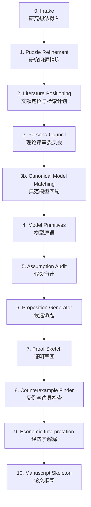

# pAI-Econ-claude

<p align="center">
  
  
  
  
  
  
  
  
  
</p>

<p align="center">
  <b>一个面向理论经济学研究的 Claude Code Skill</b><br>
  从经济学直觉出发，辅助研究者完成模型选择、原语设定、命题生成、证明草图、反例检查与论文框架搭建。
</p>

<p align="center">
  <a href="./README_EN.md">English Version</a> ·
  <a href="#快速开始">快速开始</a> ·
  <a href="#使用场景">使用场景</a> ·
  <a href="#理论模型库">理论模型库</a> ·
  <a href="#工作流">工作流</a>
</p>

---

## 项目简介

**pAI-Econ-claude** 是一个用于理论经济学研究的 **human-in-the-loop Claude Code Skill**。  
它不是让 AI 自动完成一篇理论论文，而是把理论建模过程中最容易混乱、跳步和自我确认的环节结构化，帮助研究者把一个模糊的经济学 intuition 转化为可检查、可反驳、可迭代的理论研究框架。

---

## 作者与更新

**作者：** Chen Zhu / 朱晨（China Agricultural University） · Xiaolu Wang / 王晓璐（China Agricultural University） · Weilong Zhang / 章维龙（University of Cambridge）  
**最后更新：** 2026 年 6 月 14 日

---

## 致谢与来源

本项目受 **pAI/MSc** 启发，并基于其 research pipeline 思想改造为理论经济学方向的 Claude Code Skill。

Original pAI/MSc:
- Mahmoud Abdelmoneum
- Pierfrancesco Beneventano
- Tomaso Poggio
- MIT + Perseus Labs

Reference:
- [pAI/MSc thesis record](https://dspace.mit.edu/handle/1721.1/165377)
- [PoggioAI_MSc GitHub Repository](https://github.com/PoggioAI/PoggioAI_MSc)

---

## 它解决什么问题？

理论经济学研究常常不是卡在“不会写”，而是卡在更早的阶段：

- 研究问题是否真的清楚？
- 这个想法应该放在哪个经典模型传统里？
- 新机制相对于经典模型到底新增了什么？
- 假设是否过强，是否只是为了推出想要的结论？
- 命题是否非平凡，还是由假设直接推出？
- 证明草图有哪些缺口？
- 是否存在简单反例？
- 经济学解释是否超过了形式结果本身？

**pAI-Econ-claude 的定位是理论经济学研究脚手架，而不是全自动论文机器。**  
它帮助研究者把建模过程显性化、文档化、可回溯化，并在关键节点保留人类判断。

---

## 快速开始

### 安装

```bash
npx skills add pAI-Econ-claude/pAI-Econ-claude
```

或者手动安装：

```bash
git clone https://github.com/pAI-Econ-claude/pAI-Econ-claude.git
cp -r pAI-Econ-claude ~/.claude/skills/theoretical-economics-claude-skill
```

然后在 Claude Code 中调用：

```text
/theoretical-economics-claude-skill "你的理论经济学研究想法"
```

---

## 使用场景

pAI-Econ-claude 支持不同成熟度的理论想法。你不必每次都跑完整 pipeline，可以根据任务选择合适入口。

### 1. Model Extension Mode：从经典模型出发做机制扩展

当你已经知道大致模型家族，希望加入一个新机制时，可以使用这个模式。

例如：

```text
/theoretical-economics-claude-skill "
mode: model_extension

Extend a search model by adding product healthfulness and costly attention to nutrition labels.
Can a front-of-package label increase the probability that consumers choose healthier food?
"
```

Skill 会帮助你回答：

- 这个想法继承了哪个经典 search model？
- 新增的 healthfulness 机制改变了什么？
- 消费者什么时候会主动查看营养标签？
- 降低信息成本是否一定提高健康食品购买概率？
- 是否存在反例或边界情形？
- 这个扩展是否有足够理论贡献？

---

### 2. Phenomenon-to-Model Mode：从经济现象匹配理论模型

当你有一个现象或机制直觉，但不确定该用什么理论模型时，可以使用这个模式。

例如：

```text
/theoretical-economics-claude-skill "
mode: phenomenon_to_model

I want to incorporate genetic endowment into a health capital framework.
Genetic endowment affects productivity through childhood environment, health investment,
and human capital formation. Which theoretical model is most suitable?
"
```

Skill 会比较多个候选模型家族，例如：

- Grossman health capital model
- Becker / Ben-Porath human capital investment model
- Cunha-Heckman skill formation framework
- Roy model of comparative advantage
- lifecycle investment model
- intergenerational human capital model

然后推荐一个 baseline model，并解释其他模型为什么适合或不适合。

---

### 3. Model Critique Mode：审查已有理论模型

如果你已经有模型原语、假设或命题，可以让 Skill 像理论经济学 referee 一样进行审查。

```text
/theoretical-economics-claude-skill "
mode: model_critique

Here is my model setup:
[粘贴模型原语、时序、效用函数、均衡定义和命题]

Please audit model coherence, assumptions, non-triviality, proof gaps, and possible counterexamples.
"
```

它会重点检查：

- 模型是否闭合？
- 时序是否清楚？
- 信息结构是否完整？
- 均衡概念是否合适？
- 假设是否只是为了推出想要的结论？
- 命题是否非平凡？
- 证明草图是否存在跳步？
- 是否存在 2-agent、2-period、binary-action 的简单反例？

---

### 4. Full Pipeline Mode：从研究想法跑完整理论工作流

当你只有一个早期想法，希望从 intuition 一直推进到论文框架时，可以使用完整流程。

```text
/theoretical-economics-claude-skill "
mode: full_pipeline

Investigate whether a principal facing a privately informed agent can achieve first-best efficiency
through a forcing contract when the agent's outside option is type-dependent.
"
```

完整输出包括：

- refined research puzzle
- literature positioning plan
- canonical model match
- model primitives
- assumption audit
- candidate propositions
- proof sketches
- counterexamples
- economic interpretation
- manuscript skeleton

---

### 5. Manuscript Skeleton Only：只生成论文框架

当模型、命题和主要结论已经比较清楚，只需要整理成 working paper 结构时，可以使用这个模式。

```text
/theoretical-economics-claude-skill "
mode: manuscript_skeleton_only

Here are my model, propositions, and proof sketches:
[粘贴已有内容]

Please organize them into a theoretical economics working paper skeleton.
"
```

---

## 工作流

pAI-Econ-claude 使用一个分阶段、可回溯的人机协作流程。



---

## 核心阶段

| 阶段 | 名称 | 主要产出 |
|---|---|---|
| 0 | Intake | `research_intake.md` |
| 1 | Puzzle Refinement | `research_puzzle.md` |
| 2 | Literature Positioning | `literature_positioning.md` |
| 3 | Theory Persona Council | `persona_council.md` |
| 3b | Canonical Model Matching | `canonical_model_match.md` |
| 4 | Model Primitives | `model_primitives.md` |
| 5 | Assumption Audit | `assumption_audit.md` |
| 6 | Proposition Generator | `candidate_propositions.md` |
| 7 | Proof Sketch | `proof_sketches.md` |
| 8 | Counterexample Finder | `counterexamples_and_edge_cases.md` |
| 9 | Economic Interpretation | `economic_interpretation.md` |
| 10 | Manuscript Skeleton | `manuscript_skeleton.md` |

---

## 理论模型库

pAI-Econ-claude 内置一个 `model_library/`，用于在建模前先匹配经典理论模型家族。

这一步非常重要，因为理论经济学研究不应该从零开始“凭空造模型”，而应先回答：

> 当前研究想法最接近哪个经典模型？  
> 它继承了什么？改变了什么？新增机制在哪里？

### 通用理论模型库

| 模型家族 | 适用问题 |
|---|---|
| Consumer Choice | 消费者选择、效用最大化 |
| Indirect Utility / Expenditure Minimization | 消费者理论中的对偶问题 |
| Discrete Choice / Random Utility | 离散选择、异质偏好 |
| Search Models | 搜索成本、停止规则、信息获取 |
| Costly Information Acquisition | 注意力成本、认知成本、信息处理 |
| Rational Inattention | 有限注意力、信息容量约束 |
| Signaling | 信号传递、教育信号、质量信号 |
| Screening | 逆向选择下的机制设计 |
| Moral Hazard | 隐藏行动、激励合同 |
| Adverse Selection | 柠檬市场、质量不可观测 |
| Hotelling / Product Differentiation | 产品差异化、空间竞争 |
| Disclosure / Persuasion | 信息披露、贝叶斯劝说 |
| Mechanism Design | 显示原理、激励相容 |
| Matching Models | 双边匹配、分配市场 |
| Social Learning | 羊群行为、信息瀑布 |
| Dynamic Optimization | Bellman 方程、生命周期选择 |
| OLG / Life-Cycle Models | 代际模型、生命周期投资 |
| Principal-Agent | 委托代理、合同设计 |
| General Equilibrium | 竞争均衡、市场出清 |
| Political Economy | 投票、集体选择、制度设计 |

---

### 人力资本与劳动经济学专题库

针对人力资本、教育、劳动市场、自动化和 AI 影响，Skill 还内置了专题模型库。

| 模型家族 | 适用问题 |
|---|---|
| Becker Human Capital | 一般与专用人力资本投资 |
| Ben-Porath Model | 生命周期人力资本积累 |
| Mincer Earnings Function | 教育回报与收入方程 |
| Roy Model | 部门选择、职业选择、比较优势 |
| Heckman Selection Model | 样本选择与选择偏误 |
| Heckman Treatment Effect Framework | MTE、LATE、潜在结果、选择进入处理 |
| Heckman Latent Factor Model | 不可观测能力与技能因子 |
| Cunha-Heckman Skill Formation | 技能形成、早期投资、动态互补 |
| Technology of Skill Formation | 技能生产函数 |
| Early Childhood Investment | 早期儿童发展投资 |
| Intergenerational Transmission | 人力资本代际传递 |
| Education under Credit Constraints | 信贷约束下的教育选择 |
| Occupational Choice | 职业选择与比较优势 |
| Acemoglu-Restrepo Task-Based Framework | 任务型生产、自动化与新任务 |
| Automation Displacement / Reinstatement | 替代效应、恢复效应、新任务创造 |
| Human Capital Adaptation to AI | AI 冲击下的人力资本调整 |
| Directed Technical Change / SBTC | 定向技术进步与技能偏向技术变迁 |

---

## 质量控制 Gates

Skill 内置多个质量门，用来避免“看起来像理论，其实没有理论贡献”的问题。

| Gate | 名称 | 检查内容 | 失败后建议 |
|---|---|---|---|
| Gate 1 | Novelty Risk | 问题是否可能已被文献回答 | 回到研究问题精炼 |
| Gate 2b | Canonical Fit | 模型家族是否匹配，是否只是经典模型换名 | 回到典范模型匹配 |
| Gate 2c | Theory Lineage | 是否明确理论祖先、继承内容和新增机制 | 回到典范模型匹配 |
| Gate 2 | Model Coherence | 模型原语、时序、信息结构是否一致 | 回到模型原语 |
| Gate 3 | Non-triviality | 命题是否非平凡，是否只是从假设直接推出 | 回到假设或命题 |
| Gate 4 | Proof Integrity | 证明草图是否诚实标注缺口 | 回到命题或证明 |
| Gate 5 | Economic Meaning | 经济解释是否超过形式结果 | 回到经济学解释 |

Gate 失败不会被自动隐藏，也不会被包装成通过。Skill 会明确输出：

- failure reason
- severity
- recommended loopback stage
- whether a human override is possible

---

## 人类在环检查点

理论经济学中的关键判断不应由 agent 自动决定。因此 Skill 设置了多个必须由研究者确认的节点。

| 检查点 | 位置 | 研究者需要决定 |
|---|---|---|
| HiL-1 | Puzzle Refinement 后 | 是否接受研究问题 |
| HiL-2 | Literature Positioning 后 | 是否接受文献定位 |
| HiL-3 | Persona Council 后 | 是否接受理论评审结论 |
| HiL-4 | Model Primitives 后 | 确认均衡概念；这是硬停点 |
| HiL-5 | Proposition Generator 后 | 选择哪些命题进入后续分析 |
| HiL-6 | Counterexample Finder 后 | 如何处理反例与边界情形 |

其中 **HiL-4 是 hard stop**。均衡概念，例如 Nash、SPE、BNE、PBE、competitive equilibrium 等，必须由研究者确认后才能进入下一阶段。

---

## 五个理论评审 Persona

在 Persona Council 阶段，Skill 会模拟五类理论经济学评审者进行两轮讨论。

| Persona | 关注点 |
|---|---|
| Mechanism Theorist | 机制是否清楚、有趣、非平凡 |
| Mathematical Referee | 模型是否可形式化，证明是否可能成立 |
| Economic Intuition Referee | 结果是否有真正经济学含义 |
| Journal Positioning Referee | 更像投向哪个理论或应用理论期刊 |
| Brutal Skeptic | 最强反对意见是什么 |

Brutal Skeptic 的作用不是支持项目，而是专门攻击它。如果一个想法能经受住这个 persona 的质疑，才更值得继续推进。

---

## 输出结构

一次完整运行会生成类似如下目录：

```text
econ-research-YYYYMMDD-HHMMSS/
├── outputs/
│   ├── research_intake.md
│   ├── research_puzzle.md
│   ├── literature_positioning.md
│   ├── persona_council.md
│   ├── canonical_model_match.md
│   ├── model_primitives.md
│   ├── assumption_audit.md
│   ├── candidate_propositions.md
│   ├── proof_sketches.md
│   ├── counterexamples_and_edge_cases.md
│   ├── economic_interpretation.md
│   └── manuscript_skeleton.md
└── gates/
    ├── gate-01-novelty-risk.md
    ├── gate-02b-canonical-fit.md
    ├── gate-02c-theory-lineage.md
    ├── gate-02-model-coherence.md
    ├── gate-03-non-triviality.md
    ├── gate-04-proof-integrity.md
    └── gate-05-economic-meaning.md
```

---

## 设计原则

### 1. 人类在环，而不是全自动研究

理论经济学研究中的核心判断，例如研究问题是否有意义、均衡概念是否合适、命题是否值得推进、反例是否致命，必须由研究者决定。

AI 可以辅助生成、审查和反驳，但不应替代研究者做不可逆判断。

---

### 2. 先匹配经典模型，再构造新模型

Skill 在正式定义模型原语之前，会先经过 **Canonical Model Matching**。

这一步强制回答：

- 最接近的经典模型是什么？
- 当前模型继承了哪些结构？
- 新增机制是什么？
- 新结果是否不可由经典模型直接推出？

这可以减少“经典模型换皮”的风险。

---

### 3. 诚实标注不确定性

Proof Sketch 阶段不会把草图包装成严格证明。每个证明步骤会被标注为：

- `SOLID`
- `PLAUSIBLE`
- `GAP`
- `FALSE_RISK`

这使研究者可以清楚看到哪些地方已经比较稳，哪些地方还只是 conjecture-level。

---

### 4. 主动寻找反例

Stage 8 专门寻找反例和边界情形，包括：

- 2-agent case
- 2-period case
- binary-action case
- corner solution
- alternative equilibrium
- violation of key assumptions

这一步的目标不是让模型更好看，而是尽早发现它可能失败在哪里。

---

## 项目结构

```text
pAI-Econ-claude/
├── SKILL.md
├── README.md
├── README_EN.md
├── LICENSE
├── settings.json
├── model_library/
│   ├── consumer-choice.md
│   ├── search-models.md
│   ├── costly-information-acquisition.md
│   ├── rational-inattention.md
│   ├── mechanism-design.md
│   └── human_capital_and_labor/
│       ├── becker-human-capital.md
│       ├── ben-porath-lifecycle.md
│       ├── heckman-selection.md
│       ├── cunha-heckman-skill-formation.md
│       ├── task-based-production-acemoglu-restrepo.md
│       └── human-capital-adaptation-automation-ai.md
├── prompts/
│   ├── 00-intake.md
│   ├── 01-puzzle-refinement.md
│   ├── 03b-canonical-model-match.md
│   ├── 04-model-primitives.md
│   ├── 07-proof-sketch.md
│   ├── 08-counterexample-finder.md
│   └── gate-*.md
├── templates/
└── examples/
    ├── demo-nutrition-label-attention.txt
    └── demo-human-capital-ai-automation.txt
```

---

## 适用与不适用

### 适用

- 理论经济学早期构思
- 经典模型扩展
- 机制建模
- 人力资本、劳动经济学、信息经济学、产业组织、行为经济学等理论问题
- 工作论文初步框架
- 命题和 proof sketch 的审查
- 反例与边界情形检查

### 不适用

- 真实数据清洗与实证分析
- 自动完成严格数学证明
- 自动确认文献 novelty
- 自动生成可直接投稿的论文
- 替代研究者做理论判断

---

## 已知限制

1. **不执行真实文献检索**  
   Skill 会生成 literature search plan，但 researcher 需要自行核查最新文献。

2. **Proof sketch 不是正式证明**  
   标记为 `GAP` 或 `FALSE_RISK` 的部分必须由研究者进一步推导。

3. **模型库不是百科全书**  
   `model_library/` 是建模模板库，不是完整教材。

4. **理论贡献需要研究者判断**  
   Gate 可以提示 novelty risk，但不能最终决定论文贡献。

---

## Contributing

欢迎围绕以下方向提交改进：

- auction theory、macro、IO、political economy 等专题模型库
- 更严格的 proof integrity gate
- 更丰富的 counterexample templates
- theoretical economics LaTeX manuscript template
- explore mode：多轮理论模型空间探索

基本流程：

```text
1. Fork this repository
2. Edit prompt files, model_library, or SKILL.md routing logic
3. Test on a research hypothesis end-to-end
4. Submit a PR describing what changed and why
```

---

## License

MIT License.

Copyright © 2026 Chen Zhu, Xiaolu Wang, Weilong Zhang.

Based on pAI/MSc by Mahmoud Abdelmoneum, Pierfrancesco Beneventano, and Tomaso Poggio.
