# pAI-Econ-claude

[](LICENSE)
[](https://docs.anthropic.com/en/docs/claude-code)
[](https://PoggioAI.github.io)

A Claude Code skill for **human-in-the-loop theoretical economics research**: takes an economic intuition, puzzle, or hypothesis through 11 structured stages and produces a manuscript-ready research document set.

**Authors:** Chen Zhu (China Agricultural University) · Xiaolu Wang (China Agricultural University) · Weilong Zhang (University of Cambridge)

Based on [pAI/MSc](https://dspace.mit.edu/handle/1721.1/165377) by Mahmoud Abdelmoneum, Pierfrancesco Beneventano, and Tomaso Poggio (MIT + Perseus Labs).

---

## What This Is

`theoretical-economics-claude-skill` is a single orchestrator (`SKILL.md`) plus 16 prompt files that together implement a structured research pipeline for theoretical economics. When invoked, the orchestrator:

1. Takes a raw economic research idea as input
2. Walks through 11 stages, producing a structured research document at each stage
3. Runs 5 quality gates that check novelty risk, model coherence, non-triviality, proof integrity, and economic meaning
4. Stops at 6 human checkpoints where the researcher approves or redirects key decisions
5. Produces a complete manuscript skeleton suitable for beginning a working paper

**This pipeline does NOT:**
- Complete rigorous proofs (it produces annotated proof sketches)
- Run data analysis or empirical experiments
- Fetch live papers from the internet (it generates a search plan for the researcher to execute)
- Make decisions autonomously at critical junctures (equilibrium concept, proposition selection, counterexample resolution all require researcher input)

---

## Installation

```bash
npx skills add pAI-Econ-claude/pAI-Econ-claude
```

Or manually:

```bash
git clone https://github.com/pAI-Econ-claude/pAI-Econ-claude.git
cp -r pAI-Econ-claude ~/.claude/skills/theoretical-economics-claude-skill
```

Then invoke with `/theoretical-economics-claude-skill` in any Claude Code session.

---

## Usage

### Standard invocation

```
/theoretical-economics-claude-skill "Investigate whether a principal facing a privately informed agent can achieve first-best efficiency through a forcing contract when the agent's outside option is type-dependent."
```

### From a task file

Create a file with your research hypothesis, then:

```
/theoretical-economics-claude-skill --task path/to/hypothesis.txt
```

### Resume an interrupted run

```
/theoretical-economics-claude-skill --resume path/to/econ-research-20260614-143022
```

---

## Pipeline Stages

| # | Stage | Key Output | Gate After | HiL After |
|---|-------|-----------|-----------|-----------|
| 0 | **Intake** | research_intake.md | — | — |
| 1 | **Puzzle Refinement** | research_puzzle.md | — | ★ HiL-1 |
| 2 | **Literature Positioning** | literature_positioning.md | Gate 1 | ★ HiL-2 |
| 3 | **Theory Persona Council** | persona_council.md | — | ★ HiL-3 |
| **3b** | **Canonical Model Matching** | canonical_model_match.md | **Gate 2b + 2c** | — |
| 4 | **Model Primitives** | model_primitives.md | Gate 2 | ★ HiL-4 HARD STOP |
| 5 | **Assumption Audit** | assumption_audit.md | — | — |
| 6 | **Proposition Generator** | candidate_propositions.md | Gate 3 | ★ HiL-5 |
| 7 | **Proof Sketch** | proof_sketches.md | Gate 4 | — |
| 8 | **Counterexample Finder** | counterexamples_and_edge_cases.md | — | ★ HiL-6 |
| 9 | **Economic Interpretation** | economic_interpretation.md | Gate 5 | — |
| 10 | **Manuscript Skeleton** | manuscript_skeleton.md | — | ✓ Done |

---

## Pipeline Routing Graph

```mermaid
flowchart TD
    S0["<b>Stage 0</b><br/>Intake"]
    S1["<b>Stage 1</b><br/>Puzzle Refinement"]
    HC1{{"<b>HiL-1</b><br/>Approve puzzle?"}}
    S2["<b>Stage 2</b><br/>Literature Positioning"]
    G1{"<b>Gate 1</b><br/>Novelty Risk"}
    HC2{{"<b>HiL-2</b><br/>Approve lit position?"}}
    S3["<b>Stage 3</b><br/>Persona Council<br/><i>5 personas × 2 rounds</i>"]
    HC3{{"<b>HiL-3</b><br/>Approve council verdict?"}}
    S4["<b>Stage 4</b><br/>Model Primitives"]
    G2{"<b>Gate 2</b><br/>Model Coherence"}
    HC4{{"<b>HiL-4 ★</b><br/>HARD STOP<br/>Confirm equilibrium concept"}}
    S5["<b>Stage 5</b><br/>Assumption Audit"]
    S6["<b>Stage 6</b><br/>Proposition Generator"]
    G3{"<b>Gate 3</b><br/>Non-triviality"}
    HC5{{"<b>HiL-5</b><br/>Approve propositions?"}}
    S7["<b>Stage 7</b><br/>Proof Sketches"]
    G4{"<b>Gate 4</b><br/>Proof Integrity"}
    S8["<b>Stage 8</b><br/>Counterexample Finder"]
    HC6{{"<b>HiL-6</b><br/>Resolve counterexamples"}}
    S9["<b>Stage 9</b><br/>Economic Interpretation"]
    G5{"<b>Gate 5</b><br/>Economic Meaning"}
    S10["<b>Stage 10</b><br/>Manuscript Skeleton"]
    DONE(["<b>Done</b>"])

    S0 --> S1 --> HC1
    HC1 -->|"APPROVE"| S2
    HC1 -->|"REDIRECT"| S1
    S2 --> G1
    G1 -->|"PASS"| HC2
    G1 -->|"FAIL + researcher loops"| S1
    HC2 -->|"APPROVE"| S3
    HC2 -->|"ADJUST"| S2
    S3 --> HC3
    HC3 -->|"APPROVE"| S4
    HC3 -->|"REVISE"| S3
    S4 --> G2
    G2 --> HC4
    HC4 -->|"CONFIRM"| S5
    HC4 -->|"CHANGE / RESTRUCTURE"| S4
    S5 --> S6 --> G3
    G3 -->|"PASS"| HC5
    G3 -->|"FAIL + researcher loops"| S5
    HC5 -->|"APPROVE"| S7
    HC5 -->|"SELECT / REVISE"| S6
    S7 --> G4
    G4 -->|"PASS"| S8
    G4 -->|"FAIL + researcher loops"| S6
    S8 --> HC6
    HC6 -->|"Decisions made"| S9
    S9 --> G5
    G5 -->|"PASS"| S10
    G5 -->|"FAIL + researcher loops"| S9
    S10 --> DONE

    classDef gate fill:#fff3cd,stroke:#856404,color:#000
    classDef checkpoint fill:#d1ecf1,stroke:#0c5460,color:#000
    classDef stage fill:#d4edda,stroke:#155724,color:#000
    classDef terminal fill:#f8d7da,stroke:#721c24,color:#000

    class G1,G2,G3,G4,G5 gate
    class HC1,HC2,HC3,HC4,HC5,HC6 checkpoint
    class S0,S1,S2,S3,S4,S5,S6,S7,S8,S9,S10 stage
    class DONE terminal
```



---

## Model Library

The `model_library/` directory contains concise model-pattern documents for canonical theoretical economics model families. Every pipeline run reads these documents during **Stage 3b (Canonical Model Matching)** before building model primitives.

### General Model Library (`model_library/`)

| Document | Model Family |
|----------|-------------|
| `consumer-choice.md` | Consumer Choice / Utility Maximization |
| `indirect-utility-expenditure-minimization.md` | Duality in Consumer Theory |
| `discrete-choice-random-utility.md` | Discrete Choice / Random Utility Model (RUM) |
| `search-models.md` | Sequential Search / Job Search / Price Search |
| `costly-information-acquisition.md` | Costly Information Acquisition / Attention Allocation |
| `rational-inattention.md` | Rational Inattention (Sims 2003) |
| `signaling.md` | Signaling / Spence Signaling Game |
| `screening.md` | Screening / Mechanism Design under Adverse Selection |
| `moral-hazard.md` | Moral Hazard / Hidden Action Principal-Agent |
| `adverse-selection.md` | Adverse Selection / Market Unraveling / Lemons Problem |
| `hotelling-product-differentiation.md` | Hotelling / Spatial Competition / Product Differentiation |
| `disclosure-persuasion-information-design.md` | Information Design / Bayesian Persuasion / Voluntary Disclosure |
| `mechanism-design.md` | Basic Mechanism Design / Revelation Principle |
| `matching-models.md` | Two-Sided Matching / Assignment Markets |
| `social-learning-information-cascades.md` | Social Learning / Herding / Information Cascades |
| `dynamic-optimization-bellman.md` | Dynamic Programming / Bellman Equation |
| `overlapping-generations-life-cycle.md` | Overlapping Generations / Life-Cycle Model |
| `principal-agent.md` | Principal-Agent Framework (General) |
| `general-equilibrium-basics.md` | General Competitive Equilibrium / Arrow-Debreu |
| `political-economy-collective-choice.md` | Political Economy / Collective Choice / Voting Models |

### Human Capital and Labor Library (`model_library/human_capital_and_labor/`)

A focused library for research on human capital, education, labor markets, automation, and AI-labor interaction. All pipelines involving these topics must check this library in Stage 3b.

| Document | Model Family |
|----------|-------------|
| `becker-human-capital.md` | Becker General and Specific Human Capital |
| `ben-porath-lifecycle.md` | Ben-Porath Life-Cycle Human Capital Accumulation |
| `mincer-earnings-function.md` | Mincer Earnings Function |
| `roy-model.md` | Roy Model of Selection Across Sectors |
| `heckman-selection.md` | Heckman Selection Model (Two-Step) |
| `heckman-treatment-effects.md` | Heckman Treatment Effects: MTE, LATE, Potential Outcomes |
| `heckman-latent-factor.md` | Heckman Latent Factor Model for Unobserved Skills |
| `cunha-heckman-skill-formation.md` | Cunha-Heckman Skill Formation Framework |
| `technology-of-skill-formation.md` | Technology of Skill Formation (CES Production Function) |
| `self-productivity-dynamic-complementarity.md` | Self-Productivity and Dynamic Complementarity |
| `early-childhood-investment.md` | Early Childhood Investment Model |
| `intergenerational-transmission.md` | Intergenerational Transmission of Human Capital |
| `education-credit-constraints.md` | Education Choice Under Credit Constraints |
| `occupational-choice-comparative-advantage.md` | Occupational Choice and Comparative Advantage |
| `task-based-production-acemoglu-restrepo.md` | Task-Based Production Framework (Acemoglu-Restrepo) |
| `automation-displacement-reinstatement.md` | Automation, Displacement, Reinstatement, and New Task Creation |
| `human-capital-adaptation-automation-ai.md` | Human Capital Adaptation to Automation and AI |
| `directed-technical-change-sbtc.md` | Directed Technical Change and SBTC |

### What Each Document Contains

Every model-pattern document includes 19 sections:

1. Model family name
2. Canonical economic question
3. When to use this model
4. Typical primitives
5. Timing
6. Information structure
7. Agent heterogeneity
8. Choice variables
9. Constraints
10. Equilibrium concept or solution concept
11. Main mechanism
12. Common propositions
13. Comparative statics usually available
14. Welfare implications
15. Common modeling pitfalls
16. How to extend the model
17. Example research questions this model can support
18. Closely related model families
19. When this model is not appropriate

**All documents are original summaries and reusable modeling templates. No copyrighted textbook or article passages are reproduced.**

### Stage 3b — Canonical Model Matching

After the Persona Council (Stage 3) and before Model Primitives (Stage 4), the pipeline runs Stage 3b:

1. Reads the research puzzle, literature positioning, and persona council synthesis
2. Screens all model families in `model_library/` for fit
3. Identifies 2–4 candidate families with specific fit rationales
4. Recommends one baseline model and 1–2 extensions
5. Checks whether the proposed model is a superficial relabeling of a classic model
6. Produces a **Primitives Inheritance Handoff** that specifies exactly which elements Stage 4 should adopt from the canonical baseline

Two quality gates run after Stage 3b:
- **Gate 2b (Canonical Fit):** checks coverage of relevant families, relabeling detection, fit justification quality, primitives consistency, and human capital/labor family coverage
- **Gate 2c (Theory Lineage):** requires identification of the closest canonical ancestor, a complete inheritance statement, specification of genuine changes, a precise new mechanism description, and an irreducibility condition

---

## Quality Gates

| Gate | Name | What It Checks | Failure Loopback |
|------|------|---------------|-----------------|
| 1 | **Novelty Risk** | Is the research question likely already answered in the literature? | Stage 1 |
| 2b | **Canonical Fit** | Does the proposed model fit the canonical family? Not a relabeling? | Stage 3b |
| 2c | **Theory Lineage** | Is the closest ancestor identified? Inheritance + novelty articulated? | Stage 3b |
| 2 | **Model Coherence** | Is the formal model internally consistent? | Stage 4 |
| 3 | **Non-triviality** | Are the propositions non-trivial and economically meaningful? | Stage 5 or 4 |
| 4 | **Proof Integrity** | Are the proof sketches logically sound and honestly annotated? | Stage 6 |
| 5 | **Economic Meaning** | Are interpretations consistent with formal results? No overreach? | Stage 9 |

**Gate failures do NOT automatically loop the pipeline.** They surface the failure reason and severity, and the researcher decides whether to loop back, proceed with a caveat, or override.

---

## Human Checkpoints

Six mandatory checkpoints where the pipeline stops and waits for researcher input:

| Checkpoint | After Stage | Decision Required |
|-----------|------------|------------------|
| HiL-1 | Stage 1 | Approve research puzzle or redirect |
| HiL-2 | Stage 2 + Gate 1 | Approve literature positioning or adjust scope |
| HiL-3 | Stage 3 | Accept persona council verdict or override specific personas |
| **HiL-4 ★** | Stage 4 + Gate 2 | **HARD STOP: confirm equilibrium concept before proceeding** |
| HiL-5 | Stage 6 + Gate 3 | Select which propositions to pursue |
| HiL-6 | Stage 8 | Resolve counterexamples: modify assumptions, weaken claims, or accept |

HiL-4 is a mandatory hard stop. The equilibrium concept (Nash, SPE, BNE, PBE, competitive equilibrium, etc.) must be confirmed by the researcher before Stage 5 runs.

---

## Output Files

The pipeline produces 11 structured markdown documents and 5 gate assessment files:

```
econ-research-YYYYMMDD-HHMMSS/
├── outputs/
│   ├── research_intake.md              # Structured extraction of the raw hypothesis
│   ├── research_puzzle.md              # Refined research question with mechanism and tension
│   ├── literature_positioning.md       # Literature map + search plan
│   ├── persona_council.md              # Five-persona debate with verdicts
│   ├── model_primitives.md             # Formal model specification
│   ├── assumption_audit.md             # Assumption necessity and referee risk
│   ├── candidate_propositions.md       # Formal proposition statements by type
│   ├── proof_sketches.md               # Annotated proof sketches (SOLID/GAP/FALSE_RISK)
│   ├── counterexamples_and_edge_cases.md  # Adversarial testing results
│   ├── economic_interpretation.md      # Mechanism + intuition + "so what?" paragraphs
│   └── manuscript_skeleton.md          # Full paper outline with abstract draft
└── gates/
    ├── gate-01-novelty-risk.md
    ├── gate-02-model-coherence.md
    ├── gate-03-non-triviality.md
    ├── gate-04-proof-integrity.md
    └── gate-05-economic-meaning.md
```

---

## The Five Personas (Stage 3)

The Theory Persona Council runs two debate rounds with five specialized reviewers:

| Persona | Focus | REJECT means |
|---------|-------|-------------|
| **Mechanism Theorist** | Is the mechanism interesting and well-specified? | Trivially known or economically uninteresting |
| **Mathematical Referee** | Can this be formalized with available tools? | Not formalizable or likely false |
| **Economic Intuition Referee** | Does this advance our understanding of real economies? | No genuine economic insight |
| **Journal Positioning Referee** | Where can this be published, and at what bar? | Not publishable in current framing |
| **Brutal Skeptic** | What is the most obvious reason this is wrong? | (An ACCEPT from the Skeptic is meaningful) |

---

## File Structure

```
pAI-Econ-claude/
├── SKILL.md                                 # Orchestrator — pipeline routing, gate logic, HiL protocol
├── README.md                                # This file
├── THEORETICAL_ECON_MIGRATION_PLAN.md       # Migration design from original pAI/MSc
├── LICENSE                                  # MIT
├── settings.json                            # Claude Code harness config
├── .claude/settings.local.json             # Web access permissions
├── model_library/                           # Canonical model pattern library
│   ├── consumer-choice.md
│   ├── indirect-utility-expenditure-minimization.md
│   ├── discrete-choice-random-utility.md
│   ├── search-models.md
│   ├── costly-information-acquisition.md
│   ├── rational-inattention.md
│   ├── signaling.md
│   ├── screening.md
│   ├── moral-hazard.md
│   ├── adverse-selection.md
│   ├── hotelling-product-differentiation.md
│   ├── disclosure-persuasion-information-design.md
│   ├── mechanism-design.md
│   ├── matching-models.md
│   ├── social-learning-information-cascades.md
│   ├── dynamic-optimization-bellman.md
│   ├── overlapping-generations-life-cycle.md
│   ├── principal-agent.md
│   ├── general-equilibrium-basics.md
│   ├── political-economy-collective-choice.md
│   └── human_capital_and_labor/             # Human capital and labor sub-library
│       ├── becker-human-capital.md
│       ├── ben-porath-lifecycle.md
│       ├── mincer-earnings-function.md
│       ├── roy-model.md
│       ├── heckman-selection.md
│       ├── heckman-treatment-effects.md
│       ├── heckman-latent-factor.md
│       ├── cunha-heckman-skill-formation.md
│       ├── technology-of-skill-formation.md
│       ├── self-productivity-dynamic-complementarity.md
│       ├── early-childhood-investment.md
│       ├── intergenerational-transmission.md
│       ├── education-credit-constraints.md
│       ├── occupational-choice-comparative-advantage.md
│       ├── task-based-production-acemoglu-restrepo.md
│       ├── automation-displacement-reinstatement.md
│       ├── human-capital-adaptation-automation-ai.md
│       └── directed-technical-change-sbtc.md
├── prompts/
│   ├── 00-intake.md                         # Stage 0
│   ├── 01-puzzle-refinement.md              # Stage 1
│   ├── 02-literature-positioning.md         # Stage 2
│   ├── 03-persona-council.md                # Stage 3 (5 personas × 2 rounds)
│   ├── 03b-canonical-model-match.md         # Stage 3b (Canonical Model Matching) NEW
│   ├── 04-model-primitives.md               # Stage 4
│   ├── 05-assumption-audit.md               # Stage 5
│   ├── 06-proposition-generator.md          # Stage 6
│   ├── 07-proof-sketch.md                   # Stage 7
│   ├── 08-counterexample-finder.md          # Stage 8
│   ├── 09-economic-interpretation.md        # Stage 9
│   ├── 10-manuscript-skeleton.md            # Stage 10
│   ├── gate-01-novelty-risk.md              # Gate 1
│   ├── gate-02b-canonical-fit.md            # Gate 2b (Canonical Fit) NEW
│   ├── gate-02c-theory-lineage.md           # Gate 2c (Theory Lineage) NEW
│   ├── gate-02-model-coherence.md           # Gate 2
│   ├── gate-03-non-triviality.md            # Gate 3
│   ├── gate-04-proof-integrity.md           # Gate 4
│   └── gate-05-economic-meaning.md          # Gate 5
├── templates/
│   ├── state.json                           # Pipeline state template
│   ├── author_style_guide_econ.md           # Economics writing standard
│   └── author_style_guide_default.md        # Original ML writing standard (archived)
└── examples/
    ├── quickstart-task.txt                  # Example hypothesis (principal-agent)
    ├── demo-nutrition-label-attention.txt   # Demo: costly information acquisition / search
    └── demo-human-capital-ai-automation.txt # Demo: human capital adaptation to AI
```

---

## Configuration

### Modify prompt behavior

Each prompt file in `prompts/` is self-contained. Edit any file to change what a stage produces. The orchestrator loads prompts by path — no registration needed.

### Adjust gate thresholds

Gate thresholds are defined inside each `prompts/gate-0N-*.md` file. Edit the scoring rules directly to tighten or loosen each gate.

### Adjust human checkpoints

Human checkpoint behavior is defined in the HiL Protocol section of `SKILL.md`. Edit the checkpoint format and required decisions there.

### Add a literature domain

To add economics journal domains for web search, edit `.claude/settings.local.json`:
```json
{
  "permissions": {
    "allow": [
      "WebFetch(domain:econometrica.wiley.com)",
      "WebFetch(domain:aeaweb.org)",
      "WebFetch(domain:nber.org)",
      "WebFetch(domain:ideas.repec.org)"
    ]
  }
}
```

---

## Design Principles

### Human-in-the-loop by design
The pipeline never makes irreversible decisions autonomously. The equilibrium concept, proposition set, and counterexample resolution all require explicit researcher approval. This is intentional: theoretical economics involves judgment calls that should not be automated.

### Honest about uncertainty
Proof sketches carry explicit annotations (SOLID / PLAUSIBLE / GAP / FALSE_RISK). The pipeline does not pretend to have proved what it has only sketched. Gate failures are surfaced clearly, not suppressed.

### Adversarial quality control
Stage 8 (Counterexample Finder) and Gate 3 (Non-triviality) are designed to attack the research, not support it. The Brutal Skeptic persona in Stage 3 serves the same role. If the research survives these stages, it is more robust.

### Modular and extensible
Each stage and each gate is a separate prompt file. Adding a new stage (e.g., "calibration exercise" or "policy simulation sketch") requires writing one new prompt file and updating `SKILL.md`'s routing table.

---

## Comparison with Full pAI/MSc System

| Feature | theoretical-economics-claude-skill | pAI/MSc (original) |
|---------|-----------------------------------|-------------------|
| Domain | Theoretical economics | ML theory + experiments |
| Pipeline | Theory-only (no experiment track) | Theory + experiment (parallel tracks) |
| Proof output | Annotated sketches (SOLID/GAP/FALSE_RISK) | Full LaTeX proofs with verification |
| Writeup | Manuscript skeleton + abstract draft | Full LaTeX paper (12-pass) |
| Human checkpoints | 6 (including 1 hard stop) | 2 milestone checkpoints |
| Quality gates | 5 domain-specific gates | 3 universal gates |
| Explore mode | Not in MVP | Yes (2-5 exploration cycles) |
| Experiment execution | No | Yes (Python, SLURM) |

---

## Known Limitations

1. **No live literature search.** Stage 2 generates a search plan; it does not execute it. The researcher must verify novelty manually.
2. **Proof sketches are not proofs.** Steps marked SKETCH or CONJECTURE-LEVEL require substantial formalization work before the paper can be submitted.
3. **No LaTeX compilation.** Stage 10 produces a skeleton with LaTeX fragments; it does not compile a PDF.
4. **Economics knowledge is bounded by training data.** The pipeline may not know recent working papers (post training cutoff) and may be uncertain about specific papers from niche subfields.

---

## Contributing

To improve the skill:
1. Fork the repository
2. Edit prompt files or SKILL.md routing logic
3. Test on a research hypothesis end-to-end
4. Submit a PR describing what changed and why

Areas where contributions are especially valuable:
- Domain-specific prompt improvements (auction theory, macro, IO, political economy)
- Additional gate dimensions
- Explore mode for economics (iterative model space search)
- LaTeX template integration for Stage 10

---

## Authors

**theoretical-economics-claude-skill / pAI-Econ-claude** is developed by:

| Name | Affiliation |
|------|-------------|
| **Chen Zhu** | China Agricultural University (CAU) |
| **Xiaolu Wang** | China Agricultural University (CAU) |
| **Weilong Zhang** | University of Cambridge |

## License

MIT License.

Copyright (c) 2026 Chen Zhu, Xiaolu Wang, Weilong Zhang.

Based on [pAI/MSc](https://github.com/PoggioAI/PoggioAI_MSc) by Mahmoud Abdelmoneum, Pierfrancesco Beneventano, and Tomaso Poggio (MIT + Perseus Labs).
Original citation: https://dspace.mit.edu/handle/1721.1/165377

---

---

## 中文说明

### 这是什么

`theoretical-economics-claude-skill` 是一个基于 Claude Code 的人机协作理论经济学研究管线。它将一个原始的经济学直觉、谜题或假说，通过 11 个结构化阶段，产出一套适合开始撰写 working paper 的研究文档集合。

### 核心特点

- **不做真实数据分析**，也不做 ML 实验。这是一个纯理论经济学管线。
- **不自动完成严谨证明**。Stage 7 产出带注释的 proof sketch，明确标注哪些步骤是 [SOLID]、[GAP] 或 [FALSE_RISK]。
- **强制人机协作**。在 6 个关键节点（HiL checkpoint）停止并等待研究者决策，包括一个"硬停"（HiL-4）用于确认均衡概念。
- **Gate 失败不假装通过**。5 个质量门（Novelty Risk、Model Coherence、Non-triviality、Proof Integrity、Economic Meaning）会明确输出失败原因和建议的回溯阶段。

### 管线阶段

| 阶段 | 名称 | 主要输出 |
|------|------|--------|
| 0 | 研究想法结构化摄入 | research_intake.md |
| 1 | 研究谜题精炼 | research_puzzle.md |
| 2 | 文献定位 | literature_positioning.md |
| 3 | 理论经济学 Persona 委员会（5 personas × 2 轮辩论）| persona_council.md |
| **3b** | **典范模型匹配（NEW）** | canonical_model_match.md |
| 4 | 模型原语定义 | model_primitives.md |
| 5 | 假设审计 | assumption_audit.md |
| 6 | 候选命题生成 | candidate_propositions.md |
| 7 | 证明草图（带诚实注释）| proof_sketches.md |
| 8 | 反例与边界情形检查 | counterexamples_and_edge_cases.md |
| 9 | 经济学解释 | economic_interpretation.md |
| 10 | 论文骨架（含 abstract 草稿）| manuscript_skeleton.md |

### 典范模型库（model_library/）

`model_library/` 目录包含 20 个通用理论经济学典范模型的模型模式文档，以及 `human_capital_and_labor/` 子库中针对人力资本、劳动经济学、自动化与 AI-劳动力互动主题的 18 个专题模型文档。

每份文档包含：规范经济学问题、适用场景、典型原语、时序、信息结构、均衡概念、核心机制、常见命题、比较静态、福利含义、常见建模陷阱、扩展方式和反例研究问题等 19 个标准化章节。所有内容均为原创总结，不引用任何受版权保护的教材段落。

**新增质量门：**
- **Gate 2b（典范适配门）**：检查所选模型族是否合适、是否仅为经典模型的表面重贴标签
- **Gate 2c（理论谱系门）**：要求明确最近典范祖先、继承内容、修改内容、新机制以及不可约条件

### 必须人类决策的关键节点

- HiL-1：研究谜题是否接受
- HiL-2：文献定位是否接受
- HiL-3：Persona Council 结论是否接受
- **HiL-4（硬停）**：确认均衡概念（均衡概念决定后续所有步骤，不允许 agent 自动决定）
- HiL-5：哪些候选命题进入正式分析
- HiL-6：对每个反例如何处理（修改假设、弱化命题、或接受为边界情形）

### 作者

本 Skill 由以下作者开发：
- **朱晨** — 中国农业大学（CAU）
- **王晓璐** — 中国农业大学（CAU）
- **章维龙** — 剑桥大学（University of Cambridge）

### 许可证

MIT License。基于 pAI/MSc（Abdelmoneum, Beneventano, Poggio，MIT + Perseus Labs）。
